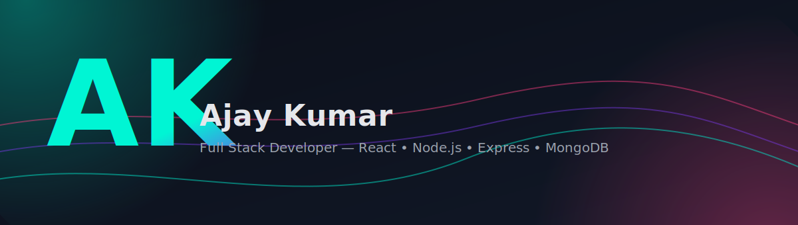

<!-- Custom Cyberpunk Neon Hero -->

  

<!-- Typing headline -->

  

<!-- Socials -->

  
  
  
  
  

<!-- Neon divider -->

  

## About
I build robust, design-forward web apps. My focus is on thoughtful interfaces, predictable state management, and backends that scale without drama.

- Location: Delhi  
- Contact: **ajaykumar8752124@gmail.com**  
- Currently learning: **Node.js** (deepening backend fundamentals)  
- Collaboration: Available for interesting projects

> “Make it simple. Make it memorable. Make it inviting to look at.” — Paul Rand

  
  

<!-- Neon divider -->

  

## Tech • Design Stack

  
   
  
   
  

  
<b>Alternate Icon Set</b>

  

    
    
    
    
    
    
    
    
    
    
    
    
    
    
    
  

<!-- Neon divider -->

  

## Featured Project
<table>
  <tr>
    <td>
      
    </td>
    <td>
      <b>E‑Commerce (React)</b> 
      Category views, product details, cart, wishlist, accessories, and custom animated UI.  
      Stack: React, React Router, CSS/SVG, dynamic JSON catalog.
    </td>
  </tr>
</table>

<!-- Neon divider -->

  

## Metrics • Activity

  

  

  

<!-- Activity Graph -->

  

<!-- Snake animation -->
## Contributions

  

<!-- Neon divider -->

  

## Contact
- Email: **ajaykumar8752124@gmail.com**  
- LinkedIn: **https://www.linkedin.com/in/ajay-kumar-901150269**  
- X (Twitter): **https://x.com/ZZyrical**

  

